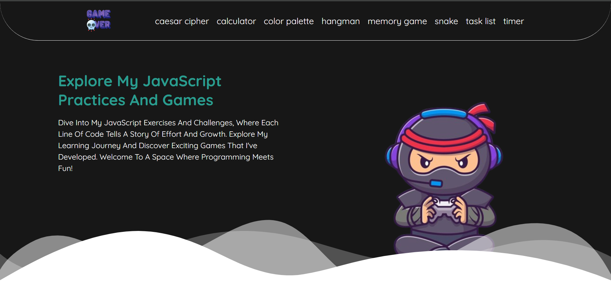
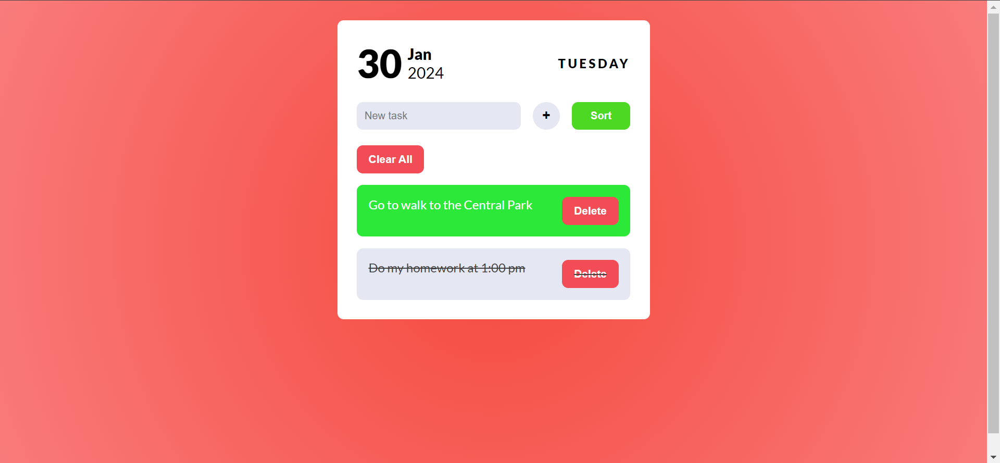
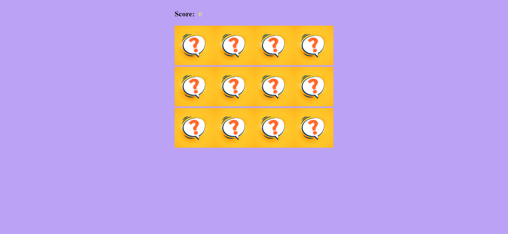
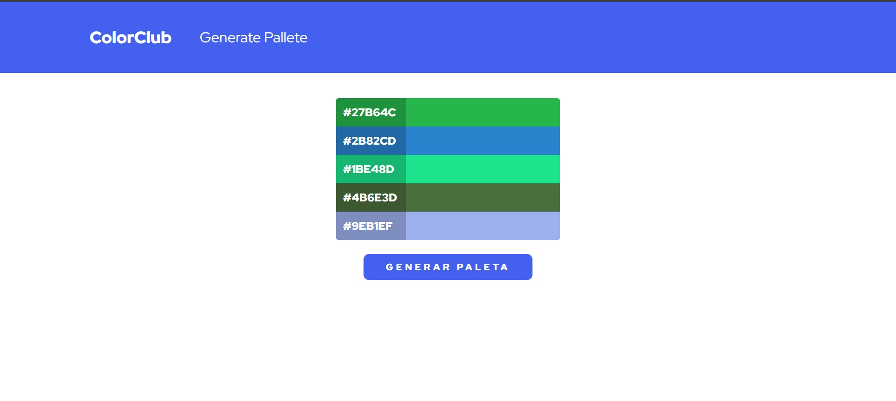

# JavaScript Practice Repository

Welcome to the JavaScript practice repository. Here, you'll find a variety of exercises and projects to enhance your programming skills with JavaScript. From simple games to practical utilities, this repository has something for everyone.



## Repository Contents

### 1. Task List

Organize your daily tasks with this simple to-do list application. Add, remove, and mark your completed tasks.



###  2. Memory Game

Have fun playing the Memory Game! Test your memory skills and enjoy the challenge.



### 3. Interactive Color Palette

Explore an interactive color palette that allows you to select and copy hexadecimal codes for your projects.



### 4. More Projects and Exercises

In addition to the mentioned ones, you'll find a variety of projects and exercises to practice and enhance your JavaScript skills.

Folder Structure
```
└── 📁site
    └── 📁assets
        └── bg.png
        └── game-over.png
        └── memoryGame.png
        └── ninja-gaming.png
        └── palette.png
        └── taskList.png
    └── index.html
    └── 📁projects
        └── 📁Caesar cipher
            └── index.html
            └── script.js
            └── styles.css
        └── 📁calculator
            └── calculator.js
            └── display.js
            └── index.html
            └── script.js
            └── styles.css
        └── 📁colorPalettes
            └── index.html
            └── script.js
            └── styles.css
        └── 📁hangman
            └── index.html
            └── palabras.js
            └── script.js
            └── styles.css
        └── 📁memoryGame
            └── 📁images
                └── blank.jpg
                └── cheeseburger.png
                └── fries.png
                └── hotdog.png
                └── ice-cream.png
                └── milkshake.png
                └── pizza.png
                └── white.png
                └── win.png
            └── index.html
            └── script.js
            └── styles.css
        └── 📁snake project
            └── index.html
            └── script.js
            └── style.css
        └── 📁taskList
            └── index.html
            └── script.js
            └── styles.css
        └── 📁timer
            └── index.html
            └── script.js
            └── styles.css
    └── styles.css
    └── wavesOpacity.svg
```